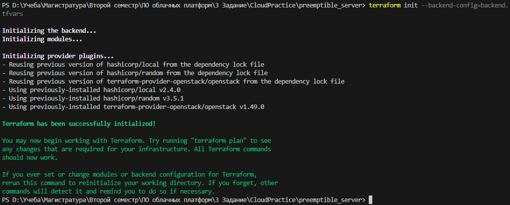
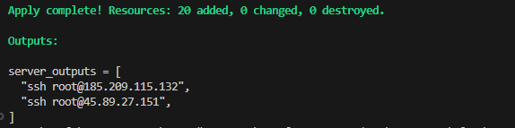
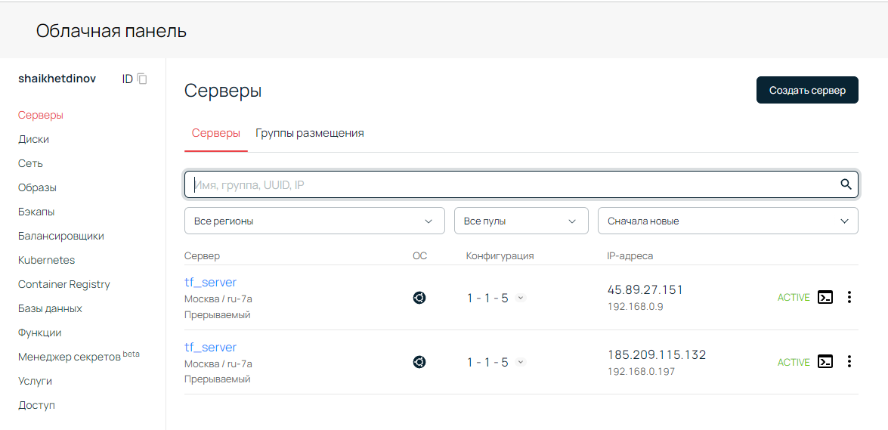
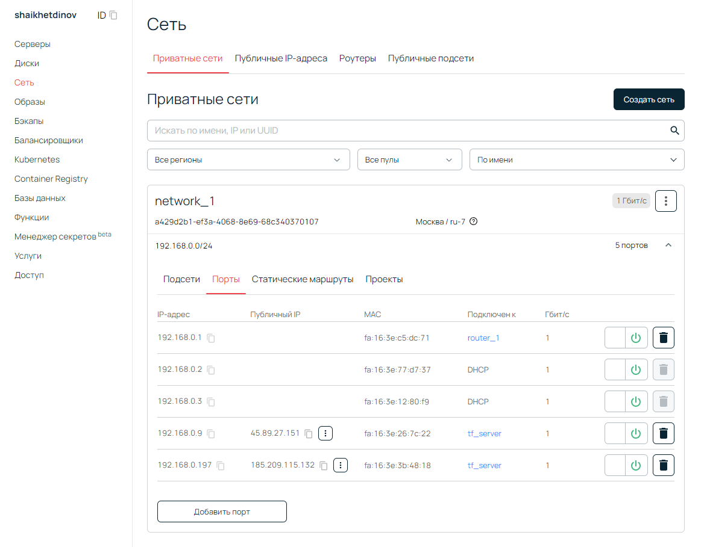
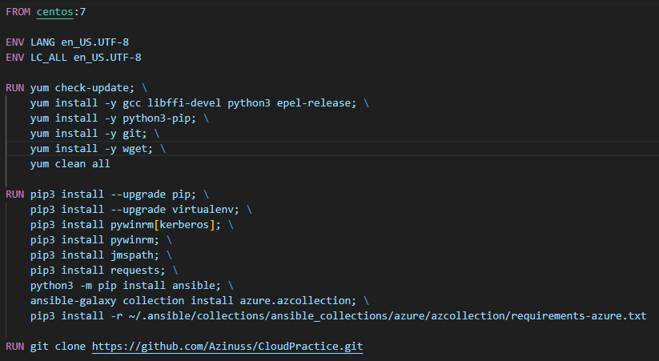
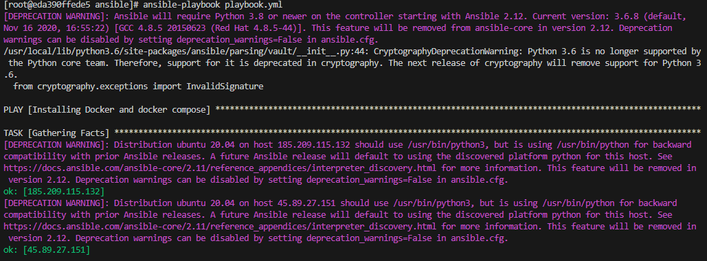
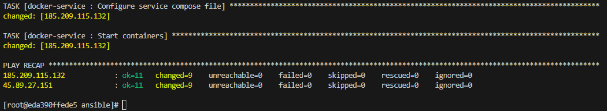
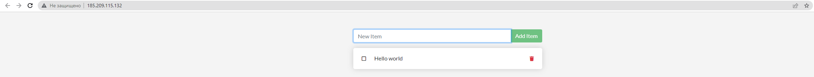
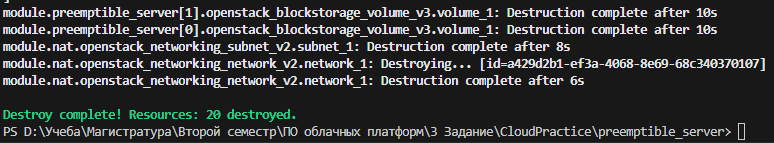

# Задание 3
## Terraform
Для начала создадим два файла( terraform.tfvars и backend.tfvars) с переменными которые будут хранить чувствительные данные, но они будут добавлены в .gitignore.
Далее инициализируем terraform командой:
```bash
terraform init --backend-config=backend.tfvars
```
В результате получем сообщение: 
После при помощи команды создадим и применим план изменений:
```bash
terraform apply
```
Как результат получим команду подключения по ssh для двух серверов и количество примененных изменений.

Проверим выполенение команды дополнительно при помощи онлайн сервиса.
Как видно, сервера онлайн:

Так же настроена локальная сеть:

## Ansible
Для работы с ansible был запущен отдельный контейнер с linux системой.

После запуска серверов при помощи terraform запустим приложения на них приложения при помощи ansible: 


## Заключение
В результате всех манипуляций был запущен сайт с небольшим функционалом:

После окончания всех работ вся структура была удалена:
